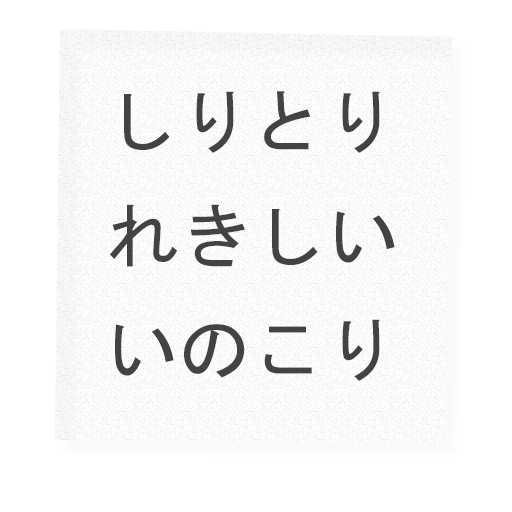

# shiritori-san  
A python bot for Discord, to play Shiritori!

The Shiritori-san bot was designed on a classic Japanese bot, originally [Harumaro](https://github.com/Harumaro) made this bot titled [Shiritori-kun](https://github.com/Harumaro/shiritori-kun-discord-bot). It just simply didn't fit my needs as I wanted a bot that was made in Python (in comparison to his Javascript). To sort this issue I made my own bot and added made it from square one attempting to retain as many features as possible from his bot. Also I made use of a checks.py created by [Rapptz](https://github.com/Rapptz).

[You can find Harumaro's original bot here.](https://github.com/Harumaro/shiritori-kun-discord-bot)

[You can find Rapptz's `checks.py` here.](https://github.com/Rapptz/RoboDanny/blob/master/cogs/utils/checks.py)

##Installation

As a standard, when you go to run the bot you will need to have atleast Python 3 as any version prior isnt supported by `discord.py`, the library in which this Discord Bot was created in. I apologise for any inconvenience that this may cause. Here are the install instructions!

Duplicate my sourcecode.

    git clone https://github.com/jakeoid/shiritori-san-discord-bot.git shiritori-san -b master

Install the requirements in the `requirements.txt`.

    sudo -H pip3.5 install --upgrade -r requirements.txt

Edit the settings inside of the bot

    nano bot.py

Launch the bot.

    python3.5 bot.py

##Usage

    <word>

Simply type any word in Kana and the bot will intepret it.

    !currentletter

Shows you the current letter in play.

    !currentplayed

Shows you the words that have already been played and what not to repeat.

    !help

Shows you the rules of the game.

    !commands

Shows you the known commands.

##Moderator.

    !reroll

Rerolls the current letter.

    !setletter <letter>

Set's the letter to `<letter>`

    !exportwords

Private Messages the staff member the letters (for a later feature).

